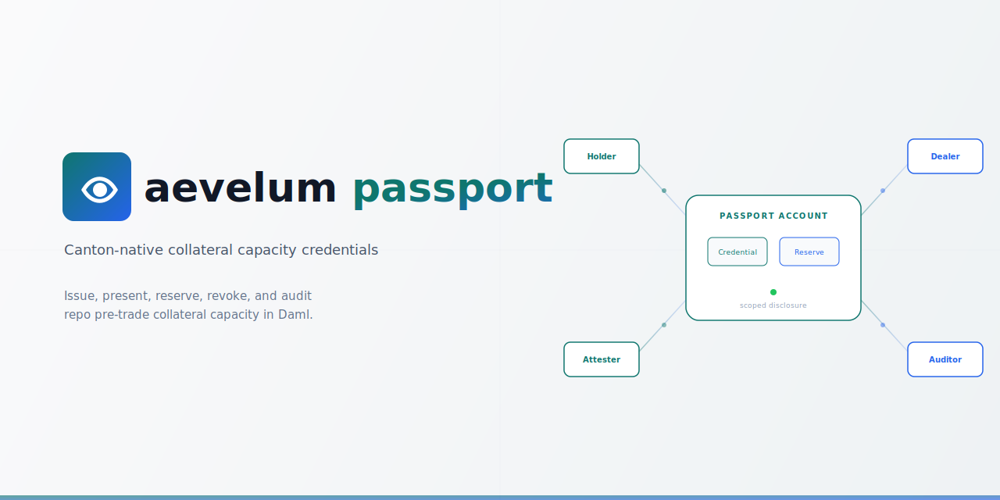

<picture>
  <source media="(prefers-color-scheme: dark)" srcset="assets/banner-dark.svg">
  <source media="(prefers-color-scheme: light)" srcset="assets/banner.svg">
  
</picture>

Aevelum Passport is the public Canton/Daml foundation for private collateral-readiness credentials.

It models collateral-capacity accounts, collateral policies, credential requests, credential issuance, counterparty-scoped presentation, bounded reservation, residual capacity, revocation, expiry, dispute metadata, reservation handoff metadata, and scoped audit disclosure. Passport may emit bounded interop artifacts and adapter-readiness reports.

Passport records readiness. Passport may record a reservation handoff notice. Passport does not execute the downstream trade. Passport does not custody, transfer, settle, or move collateral.

CapacityReservation is visible to holder, attester, and verifier. ReservationHandoffInstruction is visible to the handoff recipient. AuditDisclosureGrant is visible to the auditor.

Aevelum Passport demonstrates a roomless Canton-native collateral credential account for repo pre-trade capacity verification and reservation.

The public core proves one narrow readiness workflow:

```text
Dealer publishes collateral policy.
Holder creates Passport Account.
Holder requests capacity credential.
Attester issues CapacityCredential.
Holder presents CredentialPresentation to Dealer.
Dealer reserves part of the capacity.
Original capacity is consumed through the reservation flow.
Residual capacity is reissued.
Dealer may create a non-executing reservation handoff notice.
Dealer releases the reservation.
Attester revokes stale credentials when needed.
Unauthorized parties see nothing.
Auditor receives only scoped audit metadata.
```

## What this is

- A Daml-as-spec package.
- A roomless collateral capacity credential account.
- A repo pre-trade capacity credential demo.
- A reservation, residual-capacity, revocation, expiry, dispute, handoff, and scoped-audit model.
- A committee-facing foundation for Canton collateral workflows.

## What this is not

- Not a repo venue.
- Not a securities-lending venue.
- Not a margin engine.
- Not a custody provider.
- Not a settlement rail.
- Not a collateral-transfer system.
- Not a collateral optimizer.
- Not a credit decision engine.
- Not a wallet.
- Not a ZK system.
- Not a legal-title oracle.
- Not a diligence room.
- Not a production identity system.
- Not a live external integration.

## Project layout

```text
multi-package.yaml
AGENTS.md
.agents/
  skills/passport-hardening-loop/SKILL.md
packages/
  passport-core/
    daml.yaml
    daml/Aevelum/Passport/Types.daml
    daml/Aevelum/Passport/Foundation.daml
  passport-tests/
    daml.yaml
    daml/Aevelum/Passport/Test/*.daml
docs/
  00_product_thesis.md
  01_daml_as_spec.md
  02_foundation_release_scope.md
  03_collateral_capacity_credential.md
  04_repo_pretrade_workflow.md
  05_privacy_model.md
  06_interop_adapters.md
  07_non_goals.md
  08_brand_ui_system.md
  09_adapter_readiness_levels.md
design/
  tokens/colors.json
  change-log.md
interop/
  core/adapter.js
  core/readiness.js
  registry.js
  runner.js
  samples/repo-pretrade-passport-input.json
  plugins/cdm/
hardening/
  maps/passport.invariants.json
  frontiers/passport.frontier.json
  policies/architecture-rules.json
  rounds/round-0001.md
  rounds/round-0005.md
  change-log.md
  scripts/*.mjs
scripts/
  gates.mjs
  daml-coverage-gate.mjs
  export-demo-transcript.mjs
  interop-generate.mjs
  interop-validate.mjs
  interop-vendor-cdm.mjs
  run-daml-tests.sh
  canton-smoke.sh
  ci.sh
  package.mjs
artifacts/
  demo_transcript.json
  interop/report.json
  hardening_report.json
  hardening_map_report.json
  gate_report.json
```

## Local gates

```bash
npm run ci
```

This generates demo and interop artifacts, refreshes the hardening frontier, runs architecture and structural gates, builds both DPM packages, runs Daml Script tests, requires 100% coverage for Passport templates and domain choices, loads the core DAR into a local Canton sandbox, builds the review package, and fails if tracked generated artifacts, hardening maps, or hardening frontiers are stale. Generated `Archive` choices are excluded from the coverage threshold.

The repo-local hardening loop is discoverable to Codex agents through `.agents/skills/passport-hardening-loop/SKILL.md` and root `AGENTS.md`. To run only that lane:

```bash
npm run hardening:map
npm run hardening:frontier
npm run hardening:gate
```

The interop adapter gate generates CDM collateral eligibility artifacts from a Passport sample input and validates their JSON shape offline against the plugin-scoped FINOS CDM 6.0 JSON Schema subset. CDM adapter readiness is Level 2 — Artifact Conformance. `CheckEligibilityResult` mirrors the Passport sample decision; no CDM eligibility engine is executed.

```bash
npm run interop:validate
```

To explicitly refresh the CDM plugin's vendored schema subset from FINOS:

```bash
npm run interop:vendor:cdm
```

To run only the local Canton sandbox smoke check:

```bash
npm run canton:smoke
```

To also create the review package:

```bash
npm run all
```

`npm run all` is an alias for `npm run ci` because package creation and freshness checks are now part of the default gate. Networked supply-chain checks such as `npm audit --json` are manual checks, not part of default PR CI.

Default GitHub PR CI runs on GitHub-hosted Ubuntu with Node 24.x, Temurin Java 17, cached DPM SDK components, and normal lockfile-based `npm ci --ignore-scripts --audit=false --fund=false`. Repo-authored validation and generation paths remain network-bounded: CDM schema refreshes are explicit vendoring commands, not part of the default gate.

## Daml/Canton toolchain

This repo uses DPM, not the deprecated `daml` assistant. The package `sdk-version` pins are the source of truth and are set to SDK `3.4.11`, the latest stable DPM SDK release reported by Digital Asset's stable installer endpoint during the hardening round.

```bash
dpm install 3.4.11
dpm build --all
./scripts/run-daml-tests.sh
```

DPM install docs: <https://docs.digitalasset.com/build/3.4/dpm/dpm.html>
Canton app development docs: <https://docs.digitalasset.com/build/3.4/overview/introduction.html>
