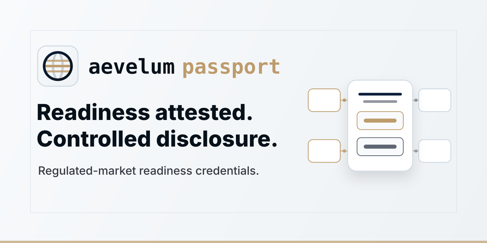

<picture>
  <source media="(prefers-color-scheme: dark)" srcset="assets/banner-dark.svg">
  <source media="(prefers-color-scheme: light)" srcset="assets/banner.svg">
  
</picture>

Aevelum Passport is the public Canton/Daml foundation for private regulated-market readiness credentials. Collateral capacity is the first credential family.

It models readiness accounts, readiness policies, externally attested credential requests, credential issuance, scoped presentation, context binding, revocation, expiry-by-validity, venue-readiness evidence wrappers, and scoped audit disclosure. The existing collateral-capacity account, policy, presentation, reservation, residual capacity, revocation, expiry, dispute metadata, reservation handoff metadata, and audit disclosure templates remain available as the first credential family and demo workflow.

Passport records attested readiness and scoped evidence only. Passport may record a reservation handoff notice. Passport does not grant licenses or legal permissions. Passport does not admit participants to a venue. Passport does not determine legal compliance. Passport does not operate a venue, exchange, ATS, SEF, MTF, regulated market, matching engine, order book, clearinghouse, custodian, settlement system, wallet, token issuer, legal-title oracle, credit engine, or production identity system. Passport does not execute the downstream trade. Passport does not custody, transfer, settle, clear, or move collateral or assets.

Passport 0.3.0 adds generic readiness credential templates with typed Daml `Time` fields for policy validity, credential validity/freshness, presentation validity, binding freshness, revocation event time, audit grant validity, and venue-readiness evidence creation time. Existing ISO timestamp text fields remain display and interop metadata; downstream Canton/Daml consumers should compare typed `Time` fields against ledger time.

VenueReadinessEvidence is a wrapper around a ReadinessBinding. Consumers must validate or cross-check the underlying ReadinessBinding before relying on VenueReadinessEvidence. Markets Phase C must not trust string readiness refs or copied wrapper fields alone. VenueReadinessUse must match ReadinessBindingPurpose.

The verifier can exercise VenueReadinessEvidence validation independently. Validation fetches the binding's live `ReadinessCredentialActiveStatus`, so revoked credentials, stale credentials, or expired readiness bindings do not validate.

ReadinessCredential is visible to holder and attester. ReadinessCredentialActiveStatus is visible to holder, attester, and approved verifiers as a minimal revocation liveness witness, not as a raw credential. ReadinessPresentation and ReadinessBinding are visible to holder, attester, and verifier. ReadinessAuditDisclosureGrant is visible to the auditor. VenueReadinessEvidence is visible to holder, attester, and verifier. CapacityReservation is visible to holder, attester, and verifier. ReservationHandoffInstruction is visible to the handoff recipient. AuditDisclosureGrant is visible to the auditor.

Aevelum Passport demonstrates a roomless Canton-native readiness credential foundation for future regulated-market workflows, with collateral capacity still demonstrated through repo pre-trade capacity verification and reservation.

The public core now proves two readiness workflows:

```text
Policy publisher creates ReadinessPolicy.
Holder creates ReadinessAccount.
Holder requests participant eligibility or license / registration attestation.
Attester issues ReadinessCredential.
Holder presents ReadinessPresentation to a verifier.
Holder, attester, and verifier bind ReadinessBinding to workflow or venue-profile context.
Auditor receives only scoped ReadinessAuditDisclosureGrant.
VenueReadinessEvidence references a valid readiness binding.
Markets fetches or cross-checks the underlying ReadinessBinding before relying on VenueReadinessEvidence.
Markets rejects venue readiness evidence if the binding's source ReadinessCredential has been revoked.

Dealer publishes collateral policy.
Holder creates Passport Account.
Holder requests capacity credential.
Attester issues CapacityCredential.
Holder presents CredentialPresentation to Dealer.
Dealer reserves part of the capacity.
Original capacity is consumed through the reservation flow.
Residual capacity is reissued.
Dealer may create a non-executing reservation handoff notice.
Dealer releases the reservation.
Attester revokes stale credentials when needed.
Unauthorized parties see nothing.
Auditor receives only scoped audit metadata.
```

## What this is

- A Daml-as-spec package.
- A regulated-market readiness credential foundation.
- A roomless collateral capacity credential account as the first credential family.
- A repo pre-trade capacity credential demo.
- A license / registration attestation model that records external evidence only.
- A venue-readiness evidence wrapper for Markets to fetch without making Passport a venue.
- A reservation, residual-capacity, revocation, expiry, dispute, handoff, and scoped-audit model.
- A committee-facing foundation for Canton regulated-market readiness workflows.

## What this is not

- Not a repo venue.
- Not a securities-lending venue.
- Not an exchange, ATS, SEF, MTF, regulated market, matching engine, or order book.
- Not a licensing authority.
- Not legal-compliance determination.
- Not venue admission.
- Not a margin engine.
- Not a custody provider.
- Not a clearinghouse.
- Not a settlement rail.
- Not a collateral-transfer system.
- Not an asset-transfer system.
- Not a token issuer.
- Not a collateral optimizer.
- Not a credit decision engine.
- Not a wallet.
- Not a ZK system.
- Not a legal-title oracle.
- Not a diligence room.
- Not a production identity system.
- Not a live external integration.

## Project layout

```text
multi-package.yaml
AGENTS.md
.agents/
  skills/passport-hardening-loop/SKILL.md
packages/
  passport-core/
    daml.yaml
    daml/Aevelum/Passport/Types.daml
    daml/Aevelum/Passport/Foundation.daml
    daml/Aevelum/Passport/Readiness/*.daml
    daml/Aevelum/Passport/VenueReadiness/*.daml
  passport-tests/
    daml.yaml
    daml/Aevelum/Passport/Test/*.daml
docs/
  00_product_thesis.md
  01_daml_as_spec.md
  02_foundation_release_scope.md
  03_collateral_capacity_credential.md
  04_repo_pretrade_workflow.md
  05_privacy_model.md
  06_interop_adapters.md
  07_non_goals.md
  08_brand_ui_system.md
  09_adapter_readiness_levels.md
  10_release_notes.md
  11_readiness_credential_framework.md
  12_venue_readiness_credentials.md
  13_license_registration_attestations.md
  14_passport_markets_boundary.md
  15_release_notes_passport_0_3.md
design/
  tokens/colors.json
  change-log.md
interop/
  core/adapter.js
  core/readiness.js
  registry.js
  runner.js
  samples/repo-pretrade-passport-input.json
  plugins/cdm/
hardening/
  maps/passport.invariants.json
  frontiers/passport.frontier.json
  policies/architecture-rules.json
  rounds/round-0001.md
  rounds/round-0005.md
  change-log.md
  scripts/*.mjs
scripts/
  gates.mjs
  daml-coverage-gate.mjs
  export-demo-transcript.mjs
  export-readiness-demo-transcript.mjs
  readiness-claim-gate.mjs
  interop-generate.mjs
  interop-validate.mjs
  interop-vendor-cdm.mjs
  run-daml-tests.sh
  canton-smoke.sh
  ci.sh
  package.mjs
artifacts/
  demo_transcript.json
  readiness_demo_transcript.json
  venue_readiness_demo_transcript.json
  interop/report.json
  hardening_report.json
  hardening_map_report.json
  gate_report.json
```

## Local gates

```bash
npm run ci
```

This generates demo and interop artifacts, refreshes the hardening frontier, runs architecture and structural gates, builds both DPM packages, runs Daml Script tests, requires 100% coverage for Passport templates and domain choices, loads the core DAR into a local Canton sandbox, builds the review package, and fails if tracked generated artifacts, hardening maps, or hardening frontiers are stale. Generated `Archive` choices are excluded from the coverage threshold.

The repo-local hardening loop is discoverable to Codex agents through `.agents/skills/passport-hardening-loop/SKILL.md` and root `AGENTS.md`. To run only that lane:

```bash
npm run hardening:map
npm run hardening:frontier
npm run hardening:formal
npm run hardening:gate
```

The readiness claim gate rejects overclaims that frame Passport as granting licenses, registering participants, admitting venue participants, operating venues, executing trades, clearing, settling, custodying assets, issuing tokens, or operating wallets.

The interop adapter gate generates CDM collateral eligibility artifacts from a Passport sample input and validates their JSON shape offline against the plugin-scoped FINOS CDM 6.0 JSON Schema subset. CDM adapter readiness is Level 2 — Artifact Conformance. `CheckEligibilityResult` mirrors the Passport sample decision; no CDM eligibility engine is executed.

```bash
npm run interop:validate
```

To explicitly refresh the CDM plugin's vendored schema subset from FINOS:

```bash
npm run interop:vendor:cdm
```

To run only the local Canton sandbox smoke check:

```bash
npm run canton:smoke
```

To also create the review package:

```bash
npm run all
```

`npm run all` is an alias for `npm run ci` because package creation and freshness checks are now part of the default gate. Networked supply-chain checks such as `npm audit --json` are manual checks, not part of default PR CI.

Default GitHub PR CI runs on GitHub-hosted Ubuntu with Node 24.x, Temurin Java 17, cached DPM SDK components, and normal lockfile-based `npm ci --ignore-scripts --audit=false --fund=false`. Repo-authored validation and generation paths remain network-bounded: CDM schema refreshes are explicit vendoring commands, not part of the default gate.

## Daml/Canton toolchain

This repo uses DPM, not the deprecated `daml` assistant. The package `sdk-version` pins are the source of truth and are set to SDK `3.4.11`, the latest stable DPM SDK release reported by Digital Asset's stable installer endpoint during the hardening round.

```bash
dpm install 3.4.11
dpm build --all
./scripts/run-daml-tests.sh
```

DPM install docs: <https://docs.digitalasset.com/build/3.4/dpm/dpm.html>
Canton app development docs: <https://docs.digitalasset.com/build/3.4/overview/introduction.html>
